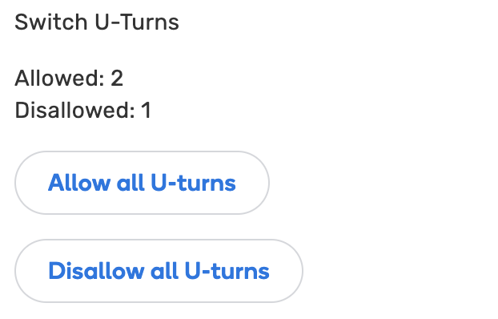

# Switch U-Turns
Adds/removes u-turns from node

## Shortcuts

<table style="width:100%">
<tr>
  <th>Shortcut</th>
  <th>Description</th>
</tr>
<tr>
<td align='center'><code>Alt</code>+<code>A</code></td>
<td align='center'>Allow all u-turns for the selected node</td>
</tr>
<tr>
<td align='center'><code>Alt</code>+<code>S</code></td>
<td align='center'>Disallow all u-turns for the selected node</td>
</tr>
<tr>
<td align='center'><code>Alt</code>+<code>Q</code></td>
<td align='center'>Switch u-turn for the point <strong>A</strong> of the selected segment</td>
</tr>
<tr>
<td align='center'><code>Alt</code>+<code>W</code></td>
<td align='center'>Switch u-turn for the point <strong>B</strong> of the selected segment</td>
</tr>
</table>

## Links
Script homepage: https://github.com/waze-ua/wme-switch-uturns  
